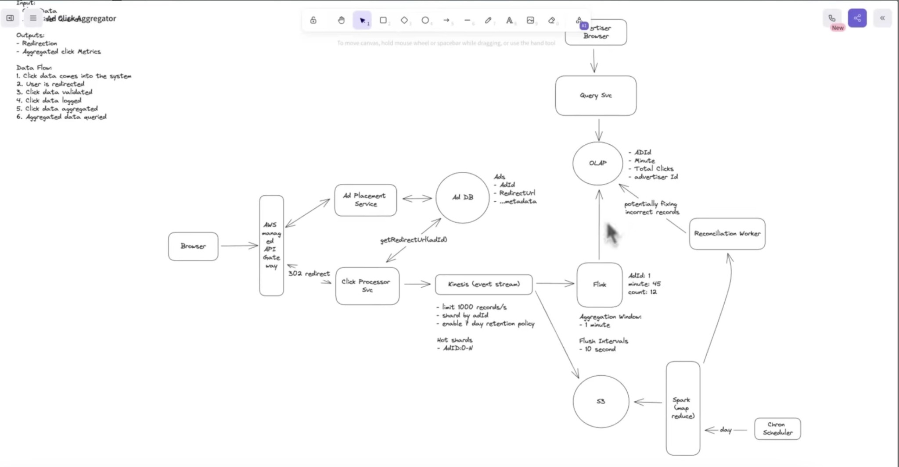

AD CLICK AGGREGATOR :

**Ad Click Aggregator tracks ad clicks via a streaming pipeline (Kinesis + Flink) for real-time aggregation and uses batch processing (Spark + S3) for reconciliation, storing analytics in an OLAP database for fast advertiser queries.**

This diagram shows a **high-level system design of an Ad Click Aggregator** — a system that records ad clicks, processes them in real time, aggregates metrics, and provides analytics for advertisers.



I'll break it into **3 parts** so it’s easy to understand:

1️⃣ **Overall Summary**
2️⃣ **Step-by-Step Data Flow**
3️⃣ **Usage of Each Component**

---

# 1️⃣ Overall Summary of the System

The system tracks **when users click ads**, processes those clicks in **real time**, aggregates metrics like **clicks per minute per ad**, and allows **advertisers to query analytics dashboards**.

The architecture supports:

✅ **High traffic click ingestion**
✅ **Real-time aggregation**
✅ **Batch reconciliation for accuracy**
✅ **Analytics querying**

Two pipelines exist:

* **Real-time pipeline → Fast metrics**
* **Batch pipeline → Accuracy correction**

---

# 2️⃣ Step-by-Step Data Flow

### Step 1 — User clicks an ad

User browser sends request.

```
Browser → API Gateway
```

---

### Step 2 — Ad Placement Service decides which ad to show

The service fetches ad metadata.

```
Ad Placement Service ↔ Ad DB
```

The system returns a **redirect URL for the ad**.

---

### Step 3 — User click gets redirected

When user clicks:

```
API Gateway → Click Processor Service
```

The click processor logs the event.

---

### Step 4 — Click event goes to streaming system

```
Click Processor → Kinesis Event Stream
```

This is a **high-throughput event pipeline**.

---

### Step 5 — Real-time stream processing

```
Kinesis → Flink
```

Flink aggregates clicks in windows like:

```
AdId + Minute → Total Clicks
```

Example result:

```
AdId = 1
Minute = 45
Clicks = 12
```

---

### Step 6 — Aggregated results stored in analytics DB

```
Flink → OLAP DB
```

OLAP is used for **fast analytical queries**.

---

### Step 7 — Advertisers query analytics

```
Advertiser Browser → Query Service → OLAP
```

They see dashboards like:

* clicks per minute
* clicks per campaign
* clicks per ad

---

### Step 8 — Batch reconciliation (data correction)

Streaming systems sometimes miss events.

So the system runs a **daily batch job**:

```
Kinesis → S3 → Spark MapReduce
```

Spark recomputes the **true counts**.

Then:

```
Spark → Reconciliation Worker → OLAP
```

This fixes incorrect metrics.

---

# 3️⃣ Usage of Each Component

## 🌐 Browser

Represents **users viewing ads**.

Functions:

* Loads webpage
* Clicks ads
* Sends requests to server

---

# 🚪 API Gateway

Acts as entry point.

Responsibilities:

✅ request routing
✅ authentication
✅ rate limiting
✅ logging

Example:

```
Browser → API Gateway → Click Processor
```

It also handles the **302 redirect**.

---

# 📢 Ad Placement Service

Responsible for **ad selection**.

Functions:

* choose which ad to show
* retrieve metadata
* provide redirect URL

Example metadata:

```
AdId
RedirectURL
Campaign
AdvertiserId
```

---

# 🗄 Ad DB

Stores ad metadata.

Example record:

```
AdId
AdvertiserId
RedirectURL
Campaign
Budget
```

This database is optimized for **read-heavy traffic**.

---

# ⚙️ Click Processor Service

Handles **incoming click events**.

Responsibilities:

* validate click
* prevent fraud
* log click
* push event to stream

Example event:

```
{
  adId: 12
  timestamp: 10:45:03
  userId: X123
}
```

---

# 🌊 Kinesis Event Stream

A **distributed event streaming platform**.

Purpose:

* buffer click events
* decouple ingestion from processing
* handle massive scale

Features:

* shards
* replay capability
* retention policy

Example throughput:

```
1000 records / second
```

---

# 🔄 Flink (Stream Processing)

Apache Flink processes streams in **real time**.

Used for:

* window aggregation
* deduplication
* near real-time metrics

Example aggregation:

```
Window: 1 minute

Group by:
AdId + Minute
```

Output:

```
AdId  Minute  Clicks
12    10:45   120
```

---

# 📊 OLAP Database

Used for **analytics queries**.

Optimized for:

* aggregation queries
* dashboards
* reporting

Typical databases used:

* ClickHouse
* Druid
* BigQuery
* Redshift

Example query:

```
SELECT SUM(clicks)
FROM ad_metrics
WHERE adId = 12
GROUP BY minute
```

---

# 💾 S3 (Data Lake)

Stores **raw click events**.

Used for:

* long term storage
* batch processing
* auditing

Why store raw events?

Because streaming pipelines may lose data.

---

# 🔥 Spark MapReduce

Runs **daily batch jobs**.

Purpose:

* recompute accurate counts
* detect missing events
* detect fraud

Example job:

```
Read raw clicks from S3
Aggregate by AdId + Minute
```

---

# 🧑‍🔧 Reconciliation Worker

Corrects inconsistencies.

Example:

If streaming result:

```
Ad1 = 100 clicks
```

But batch job says:

```
Ad1 = 105 clicks
```

Then reconciliation updates OLAP.

---

# 🔎 Query Service

Backend for advertiser dashboards.

Responsibilities:

* query OLAP
* build responses
* apply filters

Example API:

```
GET /ads/metrics?adId=12
```

---

# ⚙️ Cron Scheduler

Triggers periodic batch jobs.

Example:

```
Daily 2 AM → Run Spark job
```

---

# 📊 Why This Architecture Works

### Handles massive scale

Streaming pipeline can process **millions of clicks per second**.

---

### Real-time analytics

Advertisers see near **real-time dashboards**.

---

### Data accuracy

Batch pipeline fixes streaming errors.

---

### Fault tolerance

Using:

* streaming buffer (Kinesis)
* durable storage (S3)


