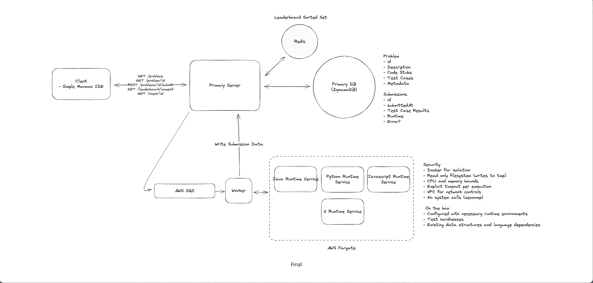

# LeetCode System Design

LeetCode is an online platform for coding practice and technical interview preparation. The system must support problem management, code submission and execution, test case validation, leaderboards, user progress tracking, and discussion forums. Key challenges include handling code execution in a secure sandbox environment, managing test cases, providing real-time feedback, and scaling to support millions of users solving problems simultaneously.




# Online Coding Judge System (LeetCode-like) 

---

# 1. Problem Overview

Design a system where users:

1. View coding problems
2. Write solutions in multiple languages
3. Submit code and receive results within **5 seconds**
4. View **live leaderboard during competitions**

Scale requirement:

* **100k concurrent competition users**

Priority:

* **Availability > Consistency**

---

Here is a **clean FAANG-style “Requirements Section” summary** you can quickly write on a **whiteboard or revise before interviews**. The goal is **clarity + structure**, because interviewers judge how you **frame the problem first**.

---

# Coding Platform (LeetCode-like) — Requirements Summary

## 1. Functional Requirements (Core)

1️⃣ **View list of problems**

* Users can fetch paginated coding problems.
* Each problem shows:

  * title
  * difficulty
  * tags

Example API:

```
GET /problems?page=1&limit=100
```

---

2️⃣ **View problem and write solution**

Users should be able to:

* open a problem
* view description
* view code stub
* code in multiple languages

Example API:

```
GET /problems/:id?language=python
```

Client uses **Monaco Editor** for coding.

---

3️⃣ **Submit solution**

Users submit code and receive execution results.

Example API:

```
POST /problems/:id/submit
{
  code,
  language
}
```

System runs:

* compilation
* test cases
* returns result.

---

4️⃣ **View live leaderboard**

Users can see rankings during competitions.

Example API:

```
GET /leaderboard/:competitionId
```

Ranking logic:

* number of problems solved
* tie breaker → earliest completion time.

---

# Out of Scope (Important to Mention)

These are **explicitly excluded** to keep system manageable.

* User authentication
* User profiles
* Payment system
* User analytics
* Social features (comments, discussions)

Assumption:

> User is already authenticated and **userId comes from session/JWT**.

---

# 2. Non-Functional Requirements

## Availability > Consistency

The system should **prefer availability**.

Example:

* temporary leaderboard inconsistencies are acceptable
* system must not block submissions.

---

## Secure Code Execution

User code must run safely.

We must ensure:

* sandbox execution
* no system access
* no network access
* resource limits.

This is typically done using **Docker**.

---

## Low Latency Results

Submission results should return within:

```
< 5 seconds
```

Which means:

* fast container execution
* efficient test harness
* asynchronous processing.

---

## Scale Requirement

System should support:

```
100,000 competition users
```

Possible traffic spike:

* many users submit code simultaneously.

System must handle:

* burst submissions
* container execution scaling.

---

# Out of Scope (Non-Functional)

Not required for interview scope:

* fault tolerance strategies
* CI/CD pipelines
* backups
* payment security.

---

# Scale Context (Important Insight)

Unlike most FAANG design problems, this system is **moderate scale**.

Approximate numbers:

* few hundred thousand users
* ~4000 problems

Implication:

We **don’t need extremely complex architecture**.

A simple **client-server architecture** works well.

---
> “The system allows users to view coding problems, write solutions in multiple languages, submit code and receive execution results, and view a competition leaderboard. The system should prioritize availability, return submission results within 5 seconds, securely execute user code in isolated environments, and scale to support competitions with up to 100k users. We assume authentication is handled outside the system.”


# 2. Core Entities

### Problem

Stores coding question and test cases.

```
Problem
- id
- title
- description
- difficulty
- tags[]
- codeStubs{language}
- testCases[]
```

### Submission

```
Submission
- id
- userId
- problemId
- code
- language
- submittedAt
- passed
- runtime
- error
- competitionId (optional)
```

### Leaderboard

```
Leaderboard
- competitionId
- userId
- solvedProblems
- lastSolveTime
```

---

# 3. API Design

### Get problems

```
GET /problems?page=1&limit=100
```

Returns:

* id
* title
* difficulty
* tags

---

### Get problem details

```
GET /problems/:id?language=python
```

Returns:

* full problem statement
* language-specific code stub
* test cases (hidden from client)

---

### Submit solution

```
POST /problems/:id/submit
{
  code,
  language
}
```

Returns:

```
{
  submissionId
}
```

Results are retrieved asynchronously.

---

### Get leaderboard

```
GET /leaderboard/:competitionId?page=1&limit=100
```

---

# 4. High Level Architecture

Main components:

Client (Monaco IDE)
↓
API Server
↓
Primary DB
↓
Job Queue
↓
Worker
↓
Language Runtime Containers
↓
Results stored in DB + Leaderboard updated in cache

---

# 5. Components Explained

## Client

Browser IDE using **Monaco Editor**

Allows:

* writing code
* selecting language
* submitting code
* viewing leaderboard

---

# API Server

Responsibilities:

* handle user requests
* fetch problems
* accept submissions
* enqueue execution jobs
* fetch leaderboard

Stateless → horizontally scalable.

---

# Database

Primary storage using **Amazon DynamoDB**

Stores:

* Problems
* Submissions

Reasons for NoSQL:

* simple key based queries
* flexible schema
* fast reads
* test cases embedded in problem

---

# Job Queue

Submission processing is **asynchronous**.

Queue using **Amazon SQS**

Purpose:

* handle burst traffic
* decouple API server from execution
* enable retries
* prevent API timeouts

Pattern used:

**Long Running Task Pattern**

---

# Worker Service

Workers continuously poll queue.

Responsibilities:

1. fetch submission job
2. select runtime container
3. execute code
4. collect results
5. store results in DB
6. update leaderboard

Workers scale horizontally.

---

# Runtime Execution

Code executed inside containers using **Docker** running on **AWS Fargate**

Each language has its own runtime:

* Java runtime
* Python runtime
* JavaScript runtime
* etc.

Container runs:

```
compile
execute test cases
capture stdout
compare results
```

---

# 6. Code Execution Flow

User submits solution.

1️⃣ API receives request
2️⃣ Submission stored in DB
3️⃣ Job pushed to queue
4️⃣ Worker picks job
5️⃣ Worker invokes language container
6️⃣ Container runs test cases
7️⃣ Results returned to worker
8️⃣ Worker updates DB
9️⃣ Leaderboard updated
🔟 Client polls for results

---

# 7. Security & Isolation

User code must be sandboxed.

Key protections:

### Container Isolation

Run code in **Docker containers**

### Read-Only Filesystem

Prevent malicious file writes.

### CPU & Memory Limits

Prevent resource exhaustion.

### Execution Timeout

Kill infinite loops after **5 seconds**.

### Disable Network Access

Prevent external API calls.

### Restricted System Calls

Using **seccomp**.

---

# 8. Leaderboard Optimization

Naive approach:

Query submissions table every request → expensive.

Optimized approach:

Use **Redis** **Sorted Set**

Key:

```
competitionId
```

Score:

```
(numSolvedProblems, lastSolveTime)
```

Benefits:

* O(log N) updates
* fast ranking
* real-time leaderboard

Client polls every **5 seconds**.

WebSockets unnecessary for this scale.

---

# 9. Handling 100k Competition Users

Key scaling strategies:

### Horizontal API Scaling

Multiple stateless API servers behind load balancer.

### Queue Buffer

Queue absorbs traffic spikes.

### Worker Autoscaling

Scale workers based on queue length.

### Container Pool

Maintain runtime container pool to avoid startup delay.

---

# 10. Running Test Cases

Instead of language-specific tests:

Use **standardized serialization format**.

Example:

```
{
 input: [3,9,20,null,null,15,7],
 output: 3
}
```

Each language runtime has a **test harness** that:

1. deserializes input
2. invokes user function
3. compares output

This avoids writing test cases for every language.

---

# 11. Key Design Patterns

Important patterns interviewers expect:

1️⃣ **Async Processing (Queue)**
2️⃣ **Long Running Task Pattern**
3️⃣ **Containerized Sandboxing**
4️⃣ **Cache for Leaderboards**
5️⃣ **Horizontal Scaling**

---

# 12. Tradeoffs Explained (Important for FAANG)

Why containers over serverless?

Serverless (Lambda) drawbacks:

* cold starts
* limited runtime control

Containers give:

* better runtime environment
* lower latency
* consistent execution.

---

# 13. One-Minute Interview Summary

If interviewer asks **“Explain your design quickly”**, say:

> “Users submit code through the API server, which stores metadata and pushes execution jobs into a queue. Workers consume jobs and run the code inside isolated Docker containers for each language. Results are written to DynamoDB and leaderboard rankings are updated in Redis Sorted Sets. The queue buffers spikes from competitions and workers scale horizontally to support up to 100k users while maintaining a 5-second response time.”

